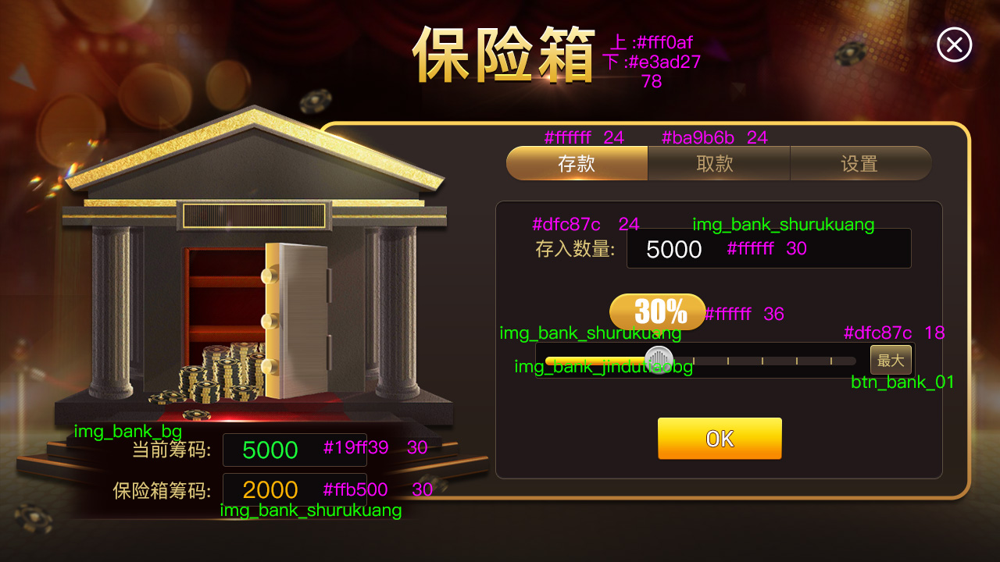

[简体中文](README.md) | [繁體中文](README.zh-TW.md) | [English](README.en.md)

# Texas Holdem Poker League, Tournament and Points Lobby Source Code

  

## Product positioning

This repository presents server-side foundations for a Texas Holdem league, club and tournament platform. The public snapshot is centered on C++, Tars service contracts and room logic. Product materials show a league and points lobby, classic Holdem, AOF, 6+ Short Deck, SNG, MTT, friend tables, rankings, insurance, store and event screens. The sections below distinguish code that can be verified in this repository from functionality shown in product materials.

## Games and tournaments

Classic Holdem covers standard table play; AOF focuses on a fast all-in-or-fold loop; 6+ Short Deck uses a reduced deck; SNG is a single-table tournament; MTT is a multi-table tournament. Product materials also show clubs, friend tables, a competitive league and points lobby. Blind, reward, insurance and tournament rules depend on deployment configuration and operating policy.

## Player journey

A player selects a game or event in the lobby, enters registration or matchmaking, and then the match and room services maintain participation, seating and table flow. Ranking or business services can present results afterward. This description is grounded in filenames, protocols and repository documentation; it is not a production load-test claim.

## Product functions

Lobby navigation; club and league entry; friend tables; SNG/MTT registration and event presentation; rankings; store and items; insurance; task and wheel event screens. Screenshots establish the UI material, but the public repository may not include every client screen or a complete operations console.

## Verifiable technical modules

`LoginProto.tars` and `LoginServantImp.cpp`: login contracts and implementation; `MatchProto.tars` and `MatchServantImp.cpp`: match/tournament APIs and core implementation; `RankProto.tars`: ranking contract; `GMServantImp.cpp` and `GlobalServantImp.cpp`: management and shared business services; `OrderServantImp.cpp` and `DBOperator.cpp`: order and database entry points; `gameroot.cpp`, `roomlogic/` and `core/`: game and room logic; `makefile`: build entry.

## Product screenshots

### 大厅与入口

### 赛事大厅

### MTT 多桌锦标赛

### SNG 单桌赛

### 经典德州牌桌

### 保险功能

## Public repository boundary

The public snapshot verifies the listed C++/Tars files, room logic and documentation. Client projects, a complete operations backend, production configuration, third-party services and commercial licensing scope require separate review. Do not treat a README as proof of deployment readiness.

## Topic and technical pages

- [Poker league source code](https://masterai-top.github.io/Texas-Holdem-Poker-League-Platform-Source-Code/en/texas-holdem-league-source-code.html)
- [Poker points lobby](https://masterai-top.github.io/Texas-Holdem-Poker-League-Platform-Source-Code/en/poker-lobby-tournament-platform.html)
- [Tournament platform](https://masterai-top.github.io/Texas-Holdem-Poker-League-Platform-Source-Code/en/poker-lobby-tournament-platform.html)
- [Texas Holdem source code](https://masterai-top.github.io/Texas-Holdem-Poker-League-Platform-Source-Code/en/poker-league-source-code.html)
- [Server architecture](./docs/server-architecture.md) · [Build guide](./docs/build-guide.md) · [Tars guide](./docs/tars-service-guide.md) · [Security](./docs/security-compliance.md)

## Contact

Telegram: @xuzongbin001 · Email: masterai918@gmail.com
